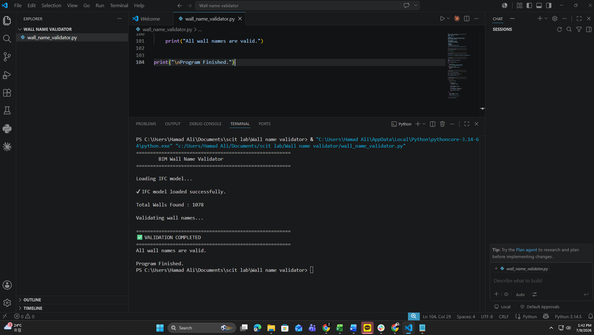

# BIM Wall Name Validator

A Python-based BIM automation tool that validates wall names in IFC Building Information Models (BIM) using IfcOpenShell.

---

# Project Overview

The BIM Wall Name Validator is a beginner-friendly BIM automation project developed using Python and IfcOpenShell.

The tool opens an IFC model, extracts all wall elements, and checks whether each wall has a valid name. If an invalid wall name (empty or "Unknown") is found, the program reports the issue and stops the validation process.

This project demonstrates how Python can be applied to automate Quality Assurance (QA/QC) tasks in BIM workflows.

---

# Features

- Load IFC models
- Read all wall elements
- Validate wall names
- Detect missing or invalid names
- Display the Global ID of invalid walls
- Report successful validation

---

# Technologies Used

- Python 3
- IfcOpenShell
- IFC (Industry Foundation Classes)

---

# Project Structure

```text
BIM-Wall-Name-Validator/
│
├── images/
│   ├── README.md
│   └── output.png
│
├── LICENSE
├── README.md
├── requirements.txt
├── sample_output.txt
└── wall_name_validator.py
```

---

# Installation

Install IfcOpenShell:

```bash
pip install ifcopenshell
```

or

```bash
pip install -r requirements.txt
```

---

# Usage

Run the program:

```bash
python wall_name_validator.py
```

---

# Program Output

The following screenshot shows the successful execution of the BIM Wall Name Validator.



---

# Learning Objectives

This project demonstrates:

- Python variables
- Loops
- If statements
- Break statements
- IFC model reading
- Basic BIM automation
- QA/QC validation using Python

---

# Future Improvements

- Validate all walls instead of stopping at the first invalid wall
- Export results to CSV
- Generate Excel reports
- Validate additional BIM properties
- Support multiple IFC files
- Develop a graphical user interface (GUI)

---

# Data Source

The IFC model used during development was obtained from publicly available Autodesk Revit sample resources and is used solely for educational and learning purposes.

---

# Author

**Hamad Ali**

Graduate Research Assistant  
Sungkyunkwan University (SKKU)

**Research Interests**

- Building Information Modeling (BIM)
- BIM Automation
- Construction AI
- Smart Construction
